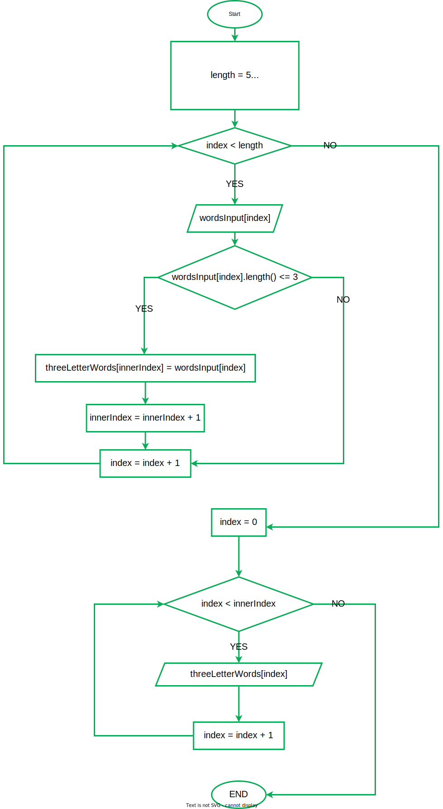

# Итоговая проверочная работа первой четверти по курсу [gb.ru](gb.ru) "Digital master"

## Содержание работы:
1. ### Задание проверочной работы
1. ### Репозиторий
2. ### Блок-схема
3. ### Задача

 

## 1. Задание проверочной работы 

 

## Репозиторий

Ссылка на репозиторий 

[https://github.com/LeeroyLiric/GB_FinalTestwork_FirstQuarter/](https://github.com/LeeroyLiric/GB_FinalTestwork_FirstQuarter/)

 

## Блок-схема

 

## Задача
### Условие задачи:
Написать программу, которая из имеющегося массива строк формирует массив из строк, длина которых меньше либо равна 3 символа. Первоначальный массив можно ввести с клавиатуры, либо задать на страрте выполнение алгоритма. При решении не рекомендуется пользоваться коллекциями, лучше обойтись исключительно массивами.
### Примеры:
["hello", "2", "world", ":-)"]->["2", ":-)"]

["1234", "1567", "-2", "computer science"]->["-2"]

["Russia", "Denmark", "world", ":-)"]->["2", ":-)"]

### Решение задачи

Файлы решения задачи находятся

В директории 

    FinalTestwork_FirstQuarter

Или по полному url-адресу 

    https://github.com/LeeroyLiric/GB_FinalTestwork_FirstQuarter/tree/main/FinalTestwork_FirstQuarter

Для запуска программы вам необходимо склонировать репозиторий в пустую директорию на вашем устройстве

    git clone https://github.com/LeeroyLiric/GB_FinalTestwork_FirstQuarter/

После клонирования вы можете открыть решение с помощью IDE запустив фаил с расширением <code>.sln</code>, или же открыть терминал в директории проекта <code>FinalTestwork_FirstQuarter</code> и выполнить команду

    dotnet run